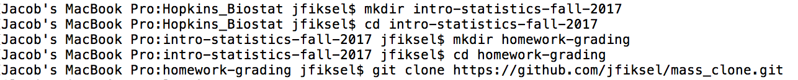

# GitHub Classroom Guide for Teachers

This is a guide for using GitHub Classroom to assist or run your class. This guide should be applicable to most classes, those that aren't compatible (Bash commands or non-supported languages) will have to be tested on Odin or a personal machine. 

<br/>
<br/>
## Below is slightly outdated! Github has created more in depth documentation, so each section will have a link for that specific topic. This will now act like a tutorial for setting up Github. Click the link below to see the starting pages of Github Classroom.
<br/>

[Github Classroom Managing Classrooms](https://docs.github.com/en/education/manage-coursework-with-github-classroom/teach-with-github-classroom/manage-classrooms)


### Steps for getting setup with GitHub
1. Register for account on GitHub (https://github.com/). We recommend using a username that incorporates your UNO NetID.

2. Install Git. Windows: https://gitforwindows.org/. Mac should already have it installed if you are running anything above Mavericks (10.9). To see if you if it is installed, open Terminal and type "git --version". If it isn't installed, it will prompt you to install it. For linux, should also already have git, but if not you can install it by running "sudo apt install git-all" or "sudo dnf install git-all".

3. Setup options in Git. Open up a Terminal or Command Prompt and cd into the project directory. Once there, we need to run a couple commands to set up git. The first command is your name, the second command is the email associated with your GitHub account.

```
git config --global user.name 'Jane Doe'
```

```
git config --global user.email 'student@email.com'
```


### Make a repo on GitHub

Below we make a repository and copy the link so that we can get the repository onto our own computer.


### Clone the repo to your local computer
On your Command Window, cd to wherever you would like your project/repository to be placed.


### Make a local change, commit, and push and confirm the local change propogated to the GitHub Remote
Once you made changes to your files and need to push (upload) them to your repository, use these commands in a command window in that assignment directory.

```
git add -a
```

If -a doesn't work, try --a, or instead of -a, you can put the file name if you just want to upload certain files

```
git commit -m "Put a meaningful comment here describing what you did"
```

```
git remote add origin https://github.com/Classroom/repo
```
The link in the above command (the https://......) will be the link to your repository/assignment

```
git push -u origin master
```

Once you run these commands, it will ask for your username (email) and password.
After you push these, you may want to run another command so you don't have to continue entering your info.

Timed (15 minutes):
```
git config --global credential.helper cache
```

Timed (specifically):
```
git config --global credential.helper "cache --timeout=3600"
```

Permanently:
```
git config --global credential.helper manager
```

### Setting up GitHub Classroom:
1. If you plan on repeating the class in future semesters, set up a "master" classroom organization. If you are teaching a class titled "Intro to Statistics", we recommend calling this organization intro-statistics-master, or something similar. We use this organization to host all assignments that will be used in the current and future versions of the class. Each assignment should be its own repository. When using GitHub classroom to send out assignments, we can use repositories from this organization as starter code. If changes need to be made for future years, you can change the repository in the organization without affecting the current version of the class. The GIF below shows how to create an organization on GitHub


Go to https://github.com/settings/connections/applications/64a051cf1598b9f0658f and grant GitHub Classroom organizational access to the master organization.


2.  Using the same process as above, create an organization for the current version of the class titled something similar to intro-statistics-fall-2017 (or whatever semester and year you're teaching). Grant GitHub Classroom organizational access to the organization. You should be able to make all assignments private or public. When creating the assignments on classroom, it will list the options and you can choose whichever you like for the respective class so that individual assignments can be private (preventing potential cheating) or public. Go to https://classroom.github.com/classrooms and click "New classroom" in the upper right corner. Choose the class you are currently teaching. Note that this step will have to be repeated for each semester.


You will also want to create a team for the students. When you are in the viewing mode for the organization, click on the "Teams" panel. Click "New team" and name this team "students".


3. Add all other teachers and TAs to the organizations as owners.

4. Go to the current year's version of the classroom organization. Under settings, go to member privileges. Change Base permissions to "none" (if it's not already) and save these changes. This will make it so that students cannot change non-assignment repositories in the organization.

5.  Add students to the organization. You can do in this two ways. The first is by manually adding students via email to the organization as members. This can be quite a pain if you have more than 5 students in your class.

    A more (but not fully) automated way to do this is by sending out an assignment. This can be the first assignment of the class, such as a practice homework or bootcamp type assignment. Once you send out (and they accept) the first assignment, they will be added to the organization as outside collaborators. See the next section for instructions on creating and giving access to assignments.

    If you want students to be organization members, rather than just outside collaborators, do the following. Go to the People section of the organization and click on Outside collaborators. Click on the gear icon next to each student's name and click invite to organization. In this invitation pop-up window, you should also see an option to add them to the students team--you should do this. Once the students accept the invitation, they should be removed from the outside collaborator panel into the members panel. They will also be added to the students team. While this is still some work, you do have a nice way of checking who has accepted the invitation.


Note the difference between outside collaborators and members. Outside collaborators only have access to repositories that their team membership allows. Outside collaborators cannot create teams or view all the organization's members and teams. If you're only using GitHub Classroom for personal assignments and not for other class materials, it is probably fine to leave everyone as an outside collaborator. However, if you have a private shared repository (such as class material outside of homeworks), you'll probably want to have teams. In this case, I would make all students members of the organization.

6.  (Optional). Create a repository (or multiple repositories) that will contain shared information, such a class syllabus, lectures, homework solutions, etc... This will be done in this year's classroom organization, although you can create it in the master organization, and then fork it over for each new class. Of course, you don't have to do this at the beginning of the class, and can add new repositories as you go along. The idea is that students can clone these repositories at the beginning of the year, and then pull in changes. However, please be aware of the possibility for merge conflicts, and think of ways to reduce them.

    If this repository is private, go into the repository, then go to Settings -> Collaborators & teams. Then add the "students" team to have read access to this repo. Done!


### Sending out individual assignments
1. Make the assignment repo in the master organization. This can include all starter code, data, etc... Be smart about naming your repository. Remember, there are no spaces allowed in GitHub repository names. We recommend using the dash "-" to separate words and numbers. A couple examples of assignment names we have used are "test-assignment" and "unit-1-assignment-1". In the example below we make this a public repository, but you can make it a private repository if you don't want others to see your class assignments.
<br/>
[Github Classroom Assignment Template](https://docs.github.com/en/education/manage-coursework-with-github-classroom/teach-with-github-classroom/create-an-assignment-from-a-template-repository)
<br/>
[Github Classroom Individual Assignments](https://docs.github.com/en/education/manage-coursework-with-github-classroom/teach-with-github-classroom/create-an-individual-assignment)
<br/>
[Github Classroom Group Assignments](https://docs.github.com/en/education/manage-coursework-with-github-classroom/teach-with-github-classroom/create-a-group-assignment)
<br/>
[Github Classroom Feedback and Pull Requests](https://docs.github.com/en/education/manage-coursework-with-github-classroom/teach-with-github-classroom/leave-feedback-with-pull-requests)
<br/>


2. Go to https://classroom.github.com/classrooms and click on the current class organization. Click new assignment, then create an individual assignment.

3. Use the repository name as the assignment name. You can skip the "Your assignment repository prefix" box, as this should automatically be filled in with the assignment name.

4. Unless you want all of the students to see each others' assignments, click Private repository. However, we make this a public repository in the example below.

5. Add the assignment from your master organization as the starter code. You will probably have to manually type out the organization name for all available repositories to show up.

6. Copy the invitation link and give students access to the link, either through a mass email and/or posting it somewhere that all the students have access to. Be somewhat careful of not posting this to a publically available place, as anyone with access to the link can then create their own assignment (why they would do this, who knows). Students should now be able to click on this link to set up the repository. Once the assignment is accepted, you should be able to see all the repos of those accepted on the assignment page.


### Grading assignments
Github Classroom has a feature for autograding. This allows students to see their grade each time they push code to the repo and get hints where it is erroring. This feature also allows you to see an overview of how all the students are doing and whether they pass or not. You can read more about it in the autograding documentation.
<br/>
[Github Classroom Autograding](https://docs.github.com/en/education/manage-coursework-with-github-classroom/teach-with-github-classroom/use-autograding)
<br/>
If you would like to grade each assignment on your Windows machine, you can download Github's Classroom Assistant, which you should be able to find in the assignment page with a button labeled "Download Repositories". When this is pressed, it will ask you to open in the assistant. Click that and it should open, allowing you to download all repositories for that assignment. The Classroom Assistant can be found at https://classroom.github.com/assistant


### THESE ALTERNATIVE INSTRUCTIONS BELOW ARE FROM ANOTHER TEACHER. IT WAS CONSIDERED THAT IT MAY BE USEFUL IF YOU DECIDE TO RUN STUFF ON ODIN OR ANOTHER LINUX MACHINE INSTEAD OF WINDOWS AND DON'T WANT TO USE THE CLASSROOM ASSISTANT.

I want to give the general outline of our grading workflow before I go into the details. The idea is that for each assignment, we will clone all of the students' assignments into our local computer using a shell script. These assignments (which are directories/repositories) will live inside a directory unique to that assignment. So, assignment1 will have an assignment1 directory, and inside of that will be many directories, one for each student's repository. We will then add comments or edit each student's homework assignment locally and save these changes. We then have a shell script that will commit these changes and push each student's repository back to GitHub with a single commit message ("Graded $date $time"). The students can then click on this commit message in their GitHub repository to see a diff and will know what you added.

Here are the steps.

1. Have a directory for the class in your local computer. Inside of this directory, I would recommend making a directory titled something similar to `homework-grading`. The way we will use this directory is that we have a shell script (more on this in the next step) that will create a sub-directory within the `homework-grading` named after an assignment prefix. The script then automatically clones all of the students' repos for this assignment into the directory.


2. Navigate to the `homework-grading` directory. The shell scripts we will be using are from https://github.com/konzy/mass_clone. You can either clone this repo, or my forked version https://github.com/jfiksel/mass_clone, into the `homework-grading` directory. Currently, my forked version allows you to pull changes in from a student's repository if they have made changes after your initial cloning. At this point, your directory structure should be as follows:

```
class-fall-2017
│
│
│
└───homework-grading
    │
    │
    │
    └───mass_clone
        │   README.me
        │   clone_all.sh
        |   clone_all_helper_example.sh
        |   push_all.sh
```

Here are the commands that I used in my terminal to do the above:



3. Edit the `clone_all_helper_example.sh` script so that your class specific organization and your username replaces the default settings in the organization and username fields

4. When you are ready to edit all the assignments, go to the terminal and navigate to the `mass_clone` repository. Type in `./clone_all_helper_example.sh`. You can then enter in the assignment prefix when prompted (or just type `./clone_all_helper_example.sh assignment-prefix`). For example, if we are grading `unit-1-homework-1`, then I would type in
`./clone_all_helper_example.sh unit-1-homework-1`. You will then be prompted to enter your GitHub password--do not enter in your actual GitHub password! Instead, you will have to enter a personal access token for the GitHub API. Here are [instructions for generating a personal access token](https://help.github.com/en/articles/creating-a-personal-access-token-for-the-command-line). Once you have generated this token, store it in a secure location on your computer so that you can copy and paste it each time you use this workflow. You may also have to change the protocol variable in `clone_all_helper_example.sh` from "ssh" to "https", although I'm not sure about this. Your directory structure will now look like this

```
class-fall-2017
│
│
│
└───homework-grading
    │
    │
    │
    |────mass_clone
    |    │   README.me
    |    │   clone_all.sh
    |    |   clone_all_helper_example.sh
    |    |   push_all.sh
    |
    |
    |
    |────unit-1-homework-1
         |
         |
         |----unit-1-homework-1-student1
         |
         |
         |----unit-1-homework-1-student2
         |
                  .
                  .
                  .
         |
         |----unit-1-homework-1-studentN
```

And here is a GIF showing how to do the above:


5. You can either edit all the assignments by typing comments into their documents, or by adding a new file with comments to each student's repository. If there is only one document that students will be editing, then it's possible to open up each student's document, put in your changes, and then save. This is also nice because you can use regular expressions to open up every student's assignment without you clicking. For example, if the document is called homework1.Rmd, and you are inside of the unit-1-homework-1 directory, you can type `open */homework1.Rmd` (you can replace open with whatever command you want so that the files open in your preferred editor). You can then work through each student's assignment, saving and then closing their assignment after you are done grading. You may or may not want to put official assignment grade into your comments due to privacy issues.

6. After saving (you have to save!) your changes and/or new files, navigate to the `mass_clone` directory. Type in `./push_all.sh assignment-prefix` (this is similar to the GIF above). This script will commit all of your changes with the same commit message ("Graded $date $time"), and then push all of the changes back to the students' repositories.

### Additional resources
* https://classroom.github.com/videos
* https://ecots2018.github.io/ another great guide from Adam Sullivan at Brown University

### Credits
This guide and alternative grading instructions were derived from https://github.com/jfiksel/github-classroom-for-teachers
